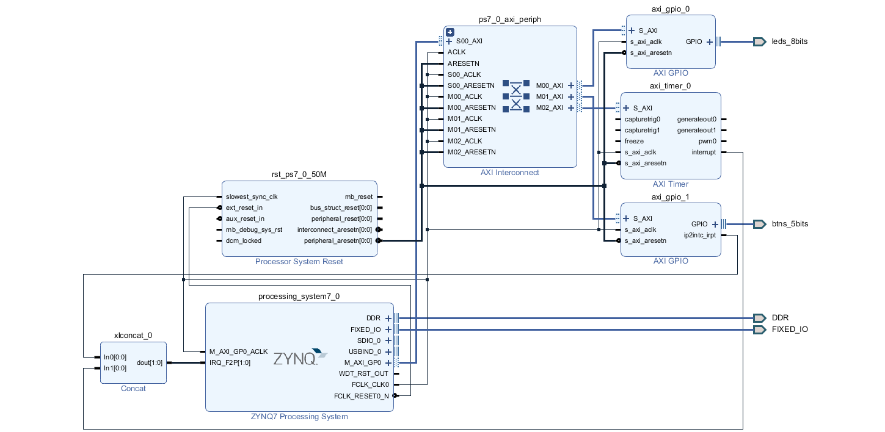

# 電路架構
## Block Design
  
具有內建Timer IP與GPIO連接外部按鈕，可實現**內部軟體觸發中斷**以及**外部按鈕觸發中斷**。

# 中斷編號
## 手冊:UG585
--- 
### Peripheral Interrupts and IRQ ID -> P.238

---
### pending register ID -> P.242

---
### enable/mask register -> P.242

---

